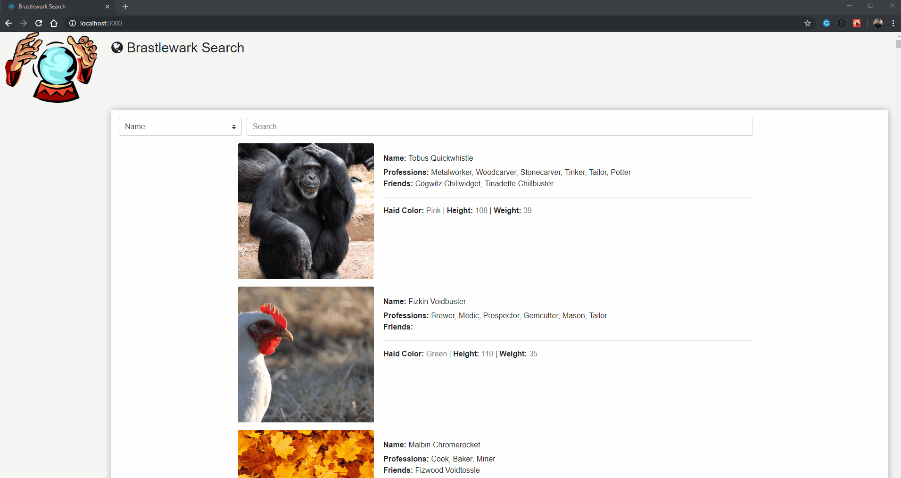

# Web App to help to search data of all the gnomes inside Brastlewark City by their names or professions, this is an assessment challenge designed to help RPG players find gnomes in the city

## Brastlewark Search

[](https://github.com/prettier/prettier)
[](https://github.com/rminelli/brastlewark-search/blob/master/LICENSE)

This project was created with:

- Axios
- Bootstrap
- Font-awesome
- Reactstrap
- Bootstrapped with [Create React App](https://github.com/facebook/create-react-app).



## How to Use

```bash
# Clone this repository
$ git clone https://github.com/rminelli/brastlewark-search

# Go into the repository
$ cd brastlewark-search

# Install dependencies
$ npm install

## Available Scripts
# In the project directory, you can run the App:
$ npm start
Runs the app in the development mode.<br>
Open http://localhost:3000 to view it in the browser. (This usually happens automatically)

$ npm test
Launches the test runner in the interactive watch mode.<br>
See the section about [running tests](https://facebook.github.io/create-react-app/docs/running-tests)

$ npm run build
Builds the app for production to the `build` folder.<br>
It correctly bundles React in production mode and optimizes the build for the best performance.

# Data source:
Census data from the city: https://raw.githubusercontent.com/rrafols/mobile_test/master/data.json

```

### Possible Improvements ❤️

- Do more units tests
- Improve data loading
- Search for another type of gnome data like friends or age
